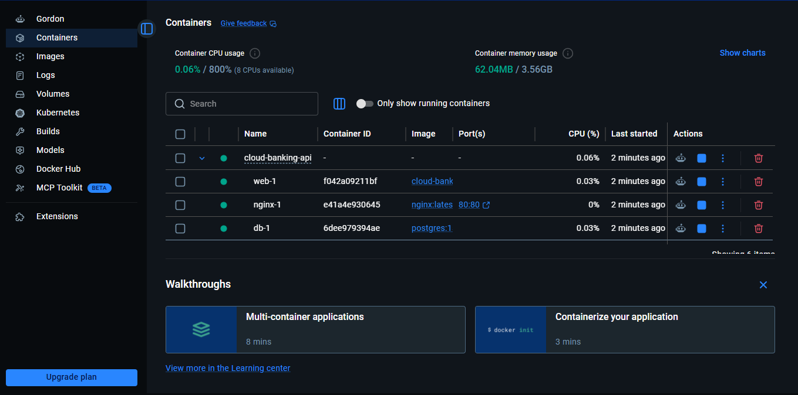
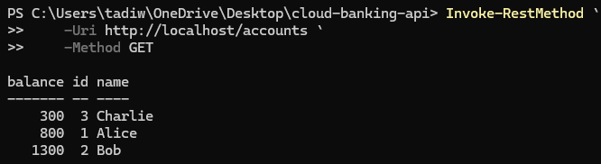
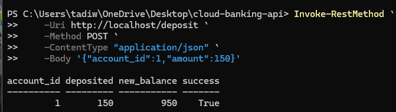
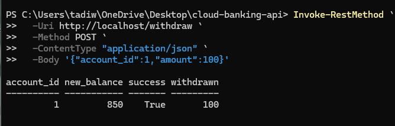
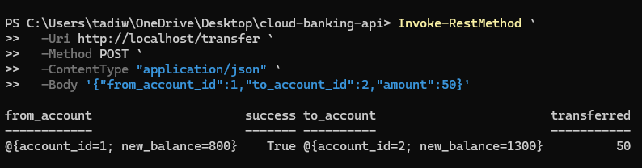
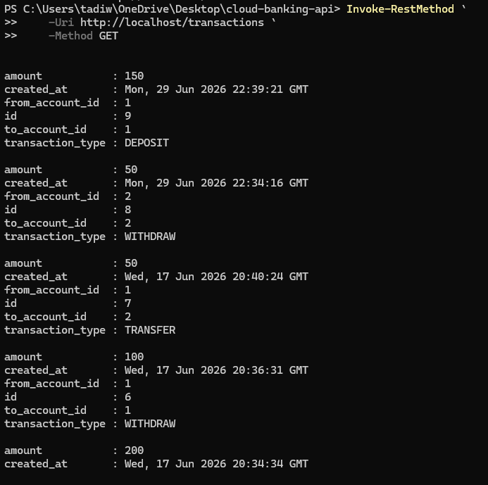

# Cloud Banking API

A production-style, full-stack banking platform built with **Docker**, **Docker Compose**, **Flask**, **PostgreSQL**, **Nginx**, and a **React/Vite** frontend.

This project demonstrates how modern backend services communicate inside a Docker network while exposing a secure REST API through a reverse proxy — paired with a polished, themed React frontend that consumes that API. It implements common banking operations including deposits, withdrawals, account-to-account transfers, and transaction auditing.

---

## Project Overview

Cloud Banking API is a multi-container full-stack application designed to simulate the core functionality of a banking system, end to end — from the database up through a real, usable interface.

The application demonstrates:

- Containerized microservice-style architecture
- RESTful API development with Flask
- PostgreSQL database integration
- Docker networking and service discovery
- Persistent database storage using Docker Volumes
- Reverse proxy architecture using Nginx
- Transaction logging and audit history
- A React/Vite frontend consuming the API, with a custom African-themed design system

This project was built as part of my backend and cloud engineering portfolio to strengthen my knowledge of Docker, networking, databases, production-style application architecture, and full-stack integration.

---

# Architecture

```
                    Internet
                        │
                        ▼
                  Web Browser
                        │
                        ▼
          React Frontend (Vite, port 5173 in dev)
                        │
                        ▼
              Nginx Reverse Proxy
                        │
                        ▼
                 Flask REST API
                        │
                        ▼
               PostgreSQL Database
                        │
                        ▼
                 Docker Volume
               (Persistent Storage)
```

---

## Request Flow

1. A client sends an HTTP request from the browser (via the React frontend or an API client).
2. Nginx receives the request on port **80**.
3. Nginx forwards the request to the Flask application running inside Docker.
4. Flask executes the requested business logic.
5. PostgreSQL stores or retrieves account information.
6. Flask returns a JSON response.
7. Nginx sends the response back to the client.

---

# Technologies

| Technology | Purpose |
|------------|---------|
| Docker | Containerization |
| Docker Compose | Multi-container orchestration |
| Python | Backend programming language |
| Flask | REST API framework |
| PostgreSQL | Relational database |
| Nginx | Reverse proxy |
| Docker Volumes | Persistent database storage |
| React | Frontend UI framework |
| Vite | Frontend build tool & dev server |
| Tailwind CSS | Utility-first styling |

---

# Features

**Backend**
- Multi-container Docker architecture
- Docker Compose orchestration
- Nginx reverse proxy
- Flask REST API
- PostgreSQL integration
- Persistent Docker volumes
- Internal Docker networking
- Account management
- Deposit funds
- Withdraw funds
- Transfer funds between accounts
- Transaction history
- JSON API responses
- Input validation
- Error handling

**Frontend**
- Full account overview with live balance data
- Deposit, withdraw, and transfer forms wired to the live API
- Transaction history table
- Custom gold / black / silver design system
- Big Five animal iconography mapped meaningfully to each banking action (Lion → Overview, Rhino → Deposit, Buffalo → Withdraw, Elephant → Transfer, Leopard → Transactions)
- African landmark photography (Baobab, Pyramids of Giza, El Djem Amphitheatre, Lake Retba, Mount Kilimanjaro)

---

# Database Schema

## Accounts

| Column | Type |
|----------|----------|
| id | SERIAL PRIMARY KEY |
| name | VARCHAR(100) |
| balance | INTEGER |

---

## Transactions

| Column | Type |
|----------|----------|
| id | SERIAL PRIMARY KEY |
| from_account_id | INTEGER |
| to_account_id | INTEGER |
| transaction_type | VARCHAR(20) |
| amount | INTEGER |
| created_at | TIMESTAMP |

---

# API Endpoints

## Get All Accounts

```http
GET /accounts
```

Example Response

```json
[
    {
        "id":1,
        "name":"Alice",
        "balance":800
    },
    {
        "id":2,
        "name":"Bob",
        "balance":1250
    }
]
```

---

## Get Account Balance

```http
GET /balance/<id>
```

Example

```http
GET /balance/1
```

Response

```json
{
    "account_id":"1",
    "balance":800
}
```

---

## Deposit Funds

```http
POST /deposit
```

Request

```json
{
    "account_id":1,
    "amount":150
}
```

Example (PowerShell)

```powershell
Invoke-RestMethod `
    -Uri http://localhost/deposit `
    -Method POST `
    -ContentType "application/json" `
    -Body '{"account_id":1,"amount":150}'
```

Response

```json
{
    "success":true,
    "account_id":1,
    "deposited":150,
    "new_balance":950
}
```

---

## Withdraw Funds

```http
POST /withdraw
```

Request

```json
{
    "account_id":1,
    "amount":100
}
```

Example (PowerShell)

```powershell
Invoke-RestMethod `
    -Uri http://localhost/withdraw `
    -Method POST `
    -ContentType "application/json" `
    -Body '{"account_id":1,"amount":100}'
```

Response

```json
{
    "success":true,
    "account_id":1,
    "withdrawn":100,
    "new_balance":850
}
```

---

## Transfer Funds

```http
POST /transfer
```

Request

```json
{
    "from_account_id":1,
    "to_account_id":2,
    "amount":50
}
```

Example (PowerShell)

```powershell
Invoke-RestMethod `
    -Uri http://localhost/transfer `
    -Method POST `
    -ContentType "application/json" `
    -Body '{"from_account_id":1,"to_account_id":2,"amount":50}'
```

Response

```json
{
    "success":true,
    "transferred":50,
    "from_account":{
        "account_id":1,
        "new_balance":800
    },
    "to_account":{
        "account_id":2,
        "new_balance":1300
    }
}
```

---

## Transaction History

```http
GET /transactions
```

Example Response

```json
[
    {
        "id":3,
        "from_account_id":1,
        "to_account_id":2,
        "transaction_type":"TRANSFER",
        "amount":50,
        "created_at":"2026-06-29T18:30:00"
    }
]
```

---

# Screenshots

## Docker Containers

> Demonstrates the multi-container application running with Nginx, Flask, and PostgreSQL.



---

## Accounts Endpoint

> Retrieve all customer accounts from PostgreSQL.



---

## Deposit Example

> Successfully deposits funds into an account and updates the database.



---

## Withdraw Example

> Withdraws funds after validating sufficient balance.



---

## Transfer Example

> Transfers money between two accounts while recording a transaction audit entry.



---

## Transaction History

> Displays the audit log of all deposits, withdrawals, and transfers.



---

# Running Locally

Clone the repository

```bash
git clone https://github.com/tadiwah-alt/cloud-banking-api.git

cd cloud-banking-api
```

## Backend

```bash
docker compose up --build
```

The API will be available at

```
http://localhost
```

Example endpoints

```
http://localhost/accounts

http://localhost/balance/1

http://localhost/transactions
```

## Frontend

In a separate terminal:

```bash
cd frontend

npm install

npm run dev
```

The UI will be available at

```
http://localhost:5173
```

The frontend expects the backend to already be running via `docker compose up`, since it makes live requests to `http://localhost` for account data.

---

# Docker Components

## Nginx

- Public-facing container
- Receives HTTP requests
- Reverse proxies requests to Flask

---

## Flask

- Implements business logic
- Exposes REST endpoints
- Connects to PostgreSQL

---

## PostgreSQL

- Stores account information
- Stores transaction history
- Executes SQL queries

---

## Docker Volume

- Persists database data
- Prevents data loss after container recreation

---

# Frontend

The `/frontend` directory contains a React + Vite single-page application that consumes this API.

**Design system:** a gold / black / silver palette built around a Big Five African animal motif, where each animal maps meaningfully to a banking action rather than serving as pure decoration — the Lion (king surveying his kingdom) represents the account Overview, the Rhino (armored, protective) represents Deposit, the Buffalo (forceful) represents Withdraw, the Elephant (migratory) represents Transfer, and the Leopard (a tracker following a trail) represents Transaction history.

**Pages:**
- **Overview** — total balance, per-account breakdown, and a "Reserves across the continent" gallery featuring the Pyramids of Giza, the El Djem Amphitheatre (Tunisia), Lake Retba (Senegal), and Mount Kilimanjaro (Tanzania)
- **Deposit / Withdraw / Transfer** — forms wired directly to the live Flask endpoints above
- **Transactions** — a full audit log table of all account activity

---

# Example Banking Workflow

Initial State

```
Alice      500

Bob       1200

Charlie    300
```

Operations

1. Deposit $200 into Alice

2. Withdraw $50 from Alice

3. Transfer $100 from Alice to Bob

Final Balances

```
Alice      550

Bob       1300

Charlie    300
```

Transaction Records Created

```
DEPOSIT

WITHDRAW

TRANSFER
```

Total Transactions

```
3
```

---

# Technical Concepts Demonstrated

- Docker Containers
- Docker Compose
- Docker Networking
- Internal DNS
- Reverse Proxy Architecture
- REST API Development
- PostgreSQL Integration
- Database Transactions
- ACID Principles
- Persistent Storage
- Service-to-Service Communication
- JSON APIs
- Input Validation
- Error Handling
- Frontend/Backend Integration
- React Component Architecture

---

# Future Enhancements

- Filter transaction history by account
- User registration
- JWT authentication
- Role-based authorization
- Redis caching
- Row-level locking (`SELECT ... FOR UPDATE`)
- Database migrations
- Health check endpoints
- GitHub Actions CI/CD
- AWS deployment (ECS)
- Kubernetes deployment
- Frontend test coverage
- Live deployed demo link

---

# Author

**Tadiwa Hukuimwe**

Cybersecurity Graduate | Cloud Security Enthusiast | Backend & Cloud Engineering

GitHub: https://github.com/tadiwah-alt

---

## License

This project is licensed under the MIT License.
